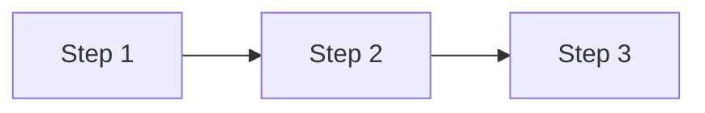

# Contributing to HireFit Documentation

## Overview

This guide explains how to contribute to the HireFit platform documentation. Good documentation is essential for team productivity, onboarding, and maintaining system knowledge.

---

## Getting Started

### Prerequisites

- Git access to the repository
- Markdown editor (VS Code recommended with Markdown extensions)
- Understanding of the area you're documenting

### Local Setup

```bash
# Clone the repository
git clone https://github.com/hirefit/platform.git
cd platform

# Documentation is in the /docs directory
cd docs

# Install documentation tools (optional, for local preview)
npm install -g markdownlint-cli
npm install -g @mermaid-js/mermaid-cli
```

---

## Documentation Types

### 1. Architecture Documentation
**Location**: `docs/architecture/`
**Purpose**: System design, technical decisions, integration patterns
**Template**: [ADR Template](templates/adr-template.md)

### 2. API Documentation
**Location**: `docs/api/`
**Purpose**: API references, authentication guides, examples
**Generated From**: OpenAPI specs where possible

### 3. Feature Specifications
**Location**: `docs/modules/`
**Purpose**: Functional requirements, data models, workflows
**Template**: [Feature Spec Template](templates/feature-spec-template.md)

### 4. Operational Runbooks
**Location**: `docs/deployment/runbooks/`
**Purpose**: Step-by-step procedures for operations
**Template**: [Runbook Template](templates/runbook-template.md)

### 5. Developer Guides
**Location**: `docs/development/`
**Purpose**: Setup guides, coding standards, best practices

---

## Writing Guidelines

### Structure

Every document should include:

1. **Title** - Clear, descriptive title
2. **Overview** - 2-3 sentence summary
3. **Body** - Main content with clear sections
4. **Document Control** - Version, date, author

### Style Guide

#### Voice and Tone
- Use active voice: "The system validates input" not "Input is validated by the system"
- Be direct and concise
- Address the reader as "you"
- Use present tense for current behavior

#### Formatting

```markdown
# Document Title

## Overview
Brief description of what this document covers.

---

## Section 1

### Subsection 1.1
Content here.

### Subsection 1.2
Content here.

---

## Section 2

...

---

## Document Control

| Version | Date | Author | Changes |
|---------|------|--------|---------|
| 1.0 | YYYY-MM-DD | Name | Initial version |
```

#### Code Blocks

Always specify the language:

```typescript
// TypeScript example
interface User {
  id: string;
  name: string;
}
```

```yaml
# YAML configuration example
setting:
  key: value
```

```sql
-- SQL example
SELECT * FROM users WHERE active = true;
```

#### Tables

Use tables for structured information:

```markdown
| Column 1 | Column 2 | Column 3 |
|----------|----------|----------|
| Data     | Data     | Data     |
```

#### Diagrams

Use ASCII art or Mermaid diagrams:

```
┌─────────┐    ┌─────────┐    ┌─────────┐
│  Step 1 │───▶│  Step 2 │───▶│  Step 3 │
└─────────┘    └─────────┘    └─────────┘
```

Or Mermaid (if supported):



### Linking

- Use relative links: `[Related Doc](../folder/document.md)`
- Link to specific sections: `[Section Name](document.md#section-name)`
- Reference external docs sparingly

---

## Contribution Process

### 1. Create a Branch

```bash
git checkout -b docs/your-change-description
```

### 2. Make Changes

- Follow the style guide
- Use appropriate templates
- Include diagrams where helpful
- Test all links

### 3. Validate

```bash
# Run markdown linting
markdownlint docs/

# Check for broken links (optional)
npm run docs:check-links
```

### 4. Submit Pull Request

- Use descriptive PR title: `docs: Add API authentication guide`
- Fill out PR template
- Request review from relevant team members

### 5. Review Process

Documentation PRs require:
- At least 1 approval from a team member
- Technical accuracy review (for technical docs)
- Style/grammar check

---

## Document Lifecycle

### Creation
1. Identify documentation need
2. Select appropriate template
3. Draft content
4. Submit for review
5. Publish

### Maintenance
- Review quarterly (at minimum)
- Update with code changes
- Archive outdated documents
- Track in CHANGELOG.md

### Archival
- Move to `docs/archive/` when obsolete
- Add archival notice at top
- Update any inbound links

---

## Templates

### Using Templates

1. Copy template to appropriate directory
2. Rename with descriptive name
3. Fill in all sections
4. Remove template instructions

### Available Templates

| Template | Purpose | Location |
|----------|---------|----------|
| ADR | Architecture decisions | `templates/adr-template.md` |
| Feature Spec | Feature requirements | `templates/feature-spec-template.md` |
| Runbook | Operational procedures | `templates/runbook-template.md` |
| Incident Report | Post-incident docs | `templates/incident-report.md` |

---

## Tools

### Recommended VS Code Extensions

- **Markdown All in One** - Editing and preview
- **markdownlint** - Linting
- **Mermaid Markdown Syntax Highlighting** - Diagram support
- **Paste Image** - Easy image insertion

### Documentation Preview

```bash
# Local preview with live reload
npx docsify-cli serve docs

# Or use VS Code preview (Ctrl+Shift+V)
```

---

## Common Issues

### Broken Links
- Use relative paths
- Check after moving/renaming files
- Run link checker before PR

### Outdated Content
- Add "Last Updated" dates
- Set review reminders
- Link to code where possible (auto-updates)

### Inconsistent Formatting
- Use markdownlint
- Follow templates
- Review style guide

---

## Questions?

- Slack: #documentation
- Email: docs@hirefit.io
- Create an issue with `documentation` label

